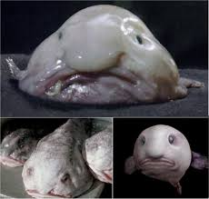
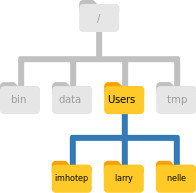

# Aula 1: The Unix Shell

## Arquivos para a lição:

1. Download do arquivo data-shell.zip e mover para Desktop.
2. Descompactar arquivo na mesma pasta.
3. Abrir terminal e se direcionar para o arquivo ~/Desktop/data-shell/

## Introdução ao Shell/Terminal

Em alto nível, computadores realizam 4 procedimentos principais:

* rodam programas
* guardam dados
* se comunicam entre si
* interagem com usuário

Em geral, utilizamos **interfaces gráficas** para indicar quais tarefas desejamos que sejam feitas pela máquina (GUI - Graphical usar interface), sendo possível realizar para **tarefas simples**.  

Porém tarefas mais complexas exigem que tenhamos um maior conhecimento de comando e gramática específicas. 

Shell/terminal - linguagem simples e interface de linha de comando. 

REPL - _read-evaluate-print_ loop

### Shell

É um programa responsável por rodar programas ao invés de realizar seus próprios cálculos. O terminal Unix mais popular é o *Bash* (Stephen Bourne).

### Como funciona

    $ ls -F \ 

* Terminal espera por algum comando de entrada
* Para executar uma tarefa, digitar um comando na estrutura: **comando + flag (opções) + argumento**.
  * flags começam com - e mudam o comportamento do comando.
  * o argumento diz onde o comando deve operar
  * um comando pode conter mais de uma flag e argumentos. 
* Testar:

      $ ls-F
      
      $LS
    
## Como o terminal sabe o qual é o comando e o que cada flag significa:

Cada comando é um programa alocado em algum lugar do computador, sendo que a shell mantém uma lista de lugares onde procura pelos comandos. Como descrito, o terminal realiza o seguinte loop:

1. Lê o comando de entrada.
2. Utiliza os espaços para identificar os elementos do código (comando+flag+argumento)
3. Encontra o programa, no caso ls, executa-o passando pelos suas flags e argumentos.
4. Imprime em tela o resultado. 
5. Retorna ao estado de espera por próximo comando. 

**A gramática de um terminal permite combinar ferramentas em pipelines e lidar com um grande volume de dados automaticamente. Sequências de comandos podem ser escritas em scripts, aumentando a reprodutibilidade e  facil repetição. É essencial seu entendimento para comunicação com máquinas remotas e supercomputadores.**

## Nelle's Pipeline

Nelle Nemo, uma biologa marinha, acabou de retornar de um levantamento de seis meses no _Giro Pacífico Norte_, onde estava pegando amostras de vida marinha gelatinosa na  _Grande Porção de Lixo do Pacífico_. Ela conseguiu 1520 amostras e agora precisa de:

1. Rodar cada amostra em uma máquina de ensaio que medirá a abundância relativa de 300 proteinas diferentes. Cada saida da máquina para cada amostra é um arquivo com uma linha para cada proteina. 

2. Calcular estatísticas para cada proteina separadamente usando um programa de seu supervisor denominado **goostats**.

3. Anotar os resultados. 

Seu supervisor sugeriu **muito** para que ela termine até o fim do mês para que seu paper apareça na revista _Aquatic Goo Letters_.

Projeções:

* Leva aproximadamente 30 minutos para que a máquina de ensaio processo cada amostra. A boa notícia é que leva-se 2 minutos para definir cada uma.
* Seu laboratório possui 8 máquinas de ensaio que podem ser usadas em paralelo: esse procedimento pode ser realizado em 2 semanas. 
* Ela precisa rodar o programa goostats: ela necessita entrar com os nomes dos arquivos e clicar enter (total de 1520 ações).
* 30 segundos por amostra: 12h (assumindo que nova entrada é realizada imediatamente).

E agora????

## Navegando nos arquivos e diretórios

### pwd

Para que Nelle possa cumprir seu prazo, ela utilizar do conhecimento na linguagem de linhas de comando para que sua comunicação com o computador seja mais otimizada possível. 

A parte do sistema operacional responsável pelo gerenciamento de arquivos e diretórios é denominada sistema de arquivos. Nos arquivos estão localizados os dados necessários para o funcionamento do computador, e os diretórios, ou também denominados pastas, são os locais onde se encontram esses arquivos. 

Essas pastas e arquivos podem ser manipulados utilizando um terminal. Inicialmente, desejamos descobrir em qual diretório encontra-se o terminal, pois os comandos já discutidos agem nos arquivos de um diretório previamente dado. Podemos digitar o comando pwd (print working directory)

        pwd

 
## Organização de diretórios no sistema Unix.

Para entender a saida do comando acima, discutamos como se encontra organizado o sistema de arquivos no sistema Unix. Observemos o sistema de arquivos do computador de Nelle

No topo, encontra-se o **root directory** (diretório raiz), caracterizado pelo primeiro **/**.

No diretório raiz encontram-se outros diretórios, como por exemplo:

* bin
* data
* users
* tmp

Existem portanto dois signficados para a barra /: quando aparece na frente de um arquivo ou diretório, refere-se ao diretório raiz, quando aparece dentro de um nome, significa apenas um separador (ou refere-se que o arquivo/diretório à direta, está localizado no diretório à esquerda).

Dentro da pasta \Users, observamos que existem três usuários: o de Nelle (nelle), e duas pastas referentes a sua colegas Mummy(imhotep) e Wolfram(larry). Tipicamente, ao abrir o terminal de comando, ele iniciará no diretório home. 

### ls

Novamente, utilizemos o comando de listagem para observar os arquivos e pastas presentem no atual diretório.

        ls
 
 Como observamos, esse comando imprime em tela a lista de arquivos e pastas na tela. Podemos adicionar a seguinte flag para se tornar mais compreensível.
 
        ls -F
        
-F caracteriza-se como uma flag que torna evidente que tipo de objeto estamos analisando. Porém, existe uma série de diferentes flags disponíveis para este comando. Podemos descobrí-los e obter descrições por dois comandos diferentes:

        $ ls --help
        
        $ man ls
        
Não podemos esquecer que tais comandos podem ser pesquisados na internet. [http://www.gnu.org/manual/manual.html]

Flags interessantes:

    $ ls -g
    
    $ ls -R
    
 Quando tenta-se utilzar de uma flag não existente:
 
    $ ls -j

### man

Tornará o terminal em uma página com a descrição do comando desejado e sua opções, e para alguns casos alguns exemplos. É necessário os botões up e down para navegar pela página. b leva ao início da página, e barra de espaço leva ao final da página. 

/palavra -> busca no man

Para sair, digite q.

##### Exercício 1:

O que as flags -l e -h fazem?

##### Exercício 2:

-R : descrição de subdiretórios e subsubdiretórios.
-t: lista por ordem de modificação.

Em que ordem ls -R -t funciona?

Objetos que não apresentam barras no fim do nome são **arquivos antigos**. 

Além disso, mesmo estando dentro de um determinado diretório, podemos listar o conteudo de outras pastas

    $ ls -F Desktop

Portanto, para utilizar o terminal, temos que ter em mente que os arquivos estão organizados de forma hierárquica o que nos ajuda a acompanhar os passos de nosso trabalho. Agora sabemos que o diretório _data-shell_ está localizado no Desktop. Podemos realizar duas ações:

### cd

Inicialmente, podemos olhar para o seu conteúdo, utilizando a mesma estratégia que antes:

    $ ls -F Desktop/data-shell
 
Além disso, podemos mudar nossa localização para um diretório diferente. 

cd - change directory - não é mudado o diretório, mas a ideia do terminal de qual diretório estamos. 

    $ cd Desktop
    
    $ cd data-shell
    
    $ cd data

    $ pwd
    
    $ ls -F
 
 Porém, como retornamos para os diretórios anteriores?
 
    $ cd ..
    
 O diretório .. não aparece quando damos um ls. Para observá-lo, podemos fazer:
 
    $ ls -F -a
 
-a está relacionado a mostrar todos os arquivos, inclusive os escondidos. 

Podemos observar na saida o diretório ./, que representa o diretório atual. 

./bash_profile : possue configurações da shell. Existem arquivos que iniciam com . que caracterizam-se por configurar diferentes programas presentes no computador. 

Em linguagem de programação, **ortogonalidade** significa que um conjunto relativamente pequeno de construções primitivas podem ser combinadas em um número de maneiras para construir as estruturas de controle e de dados de uma linguagem.
Isso pode ser verificado com:

    $ ls ..
    
 Esses portanto são os comandos mais básicos para navegar no sistema de arquivos de Unix.
 
 O que acontece caso executemos:
 
    $ cd
    
    $ pwd
    
 Retornemos ao arquivo data como anteriormente:
 
     $ cd Desktop/data-shell/data
  
 Até então, utilizamos de nosso localização atual para navegar entre os diretórios. Porém, o comando cd permite ter como argumento de localização o diretório absoluto. Desejamos ir para a pasta data:
 
  
    $ pwd
    
    $ cd /Users/nelle/Desktop/data-shell
  

 Outro argumento interessante é o ~: atual diretório home do usuário. No caso de Nelle:
 
    $ pwd ~ 
 
Outro argumento interessante é - : diretório anterior que eu estava

    $ pwd -
    
    $ cd - 
    
* .. vs -: .. leva para diretório mãe do atual e - leva ao anterior.

##### Exercício

Iniciando de /Users/amanda/data/, qual dos comandos a seguir levariam Amanda a navegar para o diretório home?

    cd .
    cd /
    cd /home/amanda
    cd ../..
    cd ~
    cd home
    cd ~/data/..
    cd
    cd ..

##### Exercício:

Utilizando do diagrama a seguir, se pwd mostra /Users/thing, o que  ls -F ../backup imprimirá?

1. ../backup: No such file or directory
2. 2012-12-01 2013-01-08 2013-01-27
3. 2012-12-01/ 2013-01-08/ 2013-01-27/
4. original/ pnas_final/ pnas_sub/

##### Exercício:

Assumindo uma estrutura de diretório como a da figura acima, se pwd mostra /Users/backup, e -r ordena ls a mostrar os arquivos em ordem reversa, qual comando irá mostrar:

    pnas_sub/ pnas_final/ original/

1. ls pwd
2. ls -r -F
3.  ls -r -F /Users/backup
4.  Either #2 or #3 above, but not #1.

## Organizando arquivos:

Sabendo sobre arquivos e diretórios, Nelle está pronta para organizar os arquivos que a máquina de ensaio criará. Inicialmente ela criará uma pasta **north-pacific-gyre** para lembrá-la de onde as amostras foram coletadas. Dentro dessa pasta ela cria o diretório 2012-07-03 que é relacionado a data em que ela iniciou o processamento de dados. Ela utilizava nomes como _conference-paper_ e _revised-results_, mas seu significado se perdia com o passar dos anos. 

Ela organizou por datas pois o terminal irá imprimir os arquivos por ordem alfabética. Dando nomes de meses, Dezembro virá primeiro que Julho. Além disso, utilizando os 0s, é evitado novembro 11 vir antes de Julho 7. Além disso, iniciando pelo ano, evitará que Junho 2012 venha depois de Junho 2013.

Cada uma de suas amostras são nomeadas de acordo com uma convenção proporcionando um ID único, como NENE01729A. Esse formato foi utilizado em seus logs para registrar a localização, tempo, profundidado e outras características. Decidiu utilizar o ID como nome de seus arquivos, em formato .txt pois a saída da máquina é em formato texto. Todos os arquivos irão em um mesmo diretório.

Em data-shell, acessemos seus dados com o uso do botão tab:

    $ ls north-pacific-gyre/2012-07-03/

## Trabalhando com arquivos de diretórios

### mkdir
Criemos um novo diretório chamado _thesis_ utilizando o comando mkdir (make directory).

	$ mkdir thesis

O arquivo é criado no diretório atual

	$ ls -F

Caso queiramos conferir graficamente, notaremos que o arquivo encontra-se na pasta atual.

**Dicas de nomes para pastas:**

1. Como espaços em branco são utilizados para quebrar comandos em flags e argumentos, é interessante evitá-los.
2. Não começar os nomes com -, pois os comandos interpretam - como uma opção.
3. Separe paravras com pontos, traços e underlines.

Caso seja necessário se referir a um nome de arquivo ou diretório com espaços, devemos utilizar "".

Listando os arquivos em thesis, observamos que não há arquivos dentro do diretório:

	$ ls -F thesis

Mudemos nosso diretório de trabalho para a pasta thesis, e criemos um arquivo de texto utilizando o editor de texto Nano:

	$ cd thesis
	$ nano draft.txt

O editor Nano trabalha apenas com textos, não suportando tabelas imagens ou outros tipos de mídia. É um dos editores menos complexos, porém, pode não ser tão flexível para a exigência do trabalho de Nelle. Temos outros editores como Emacs, Vim e Gedit. 

Vamos escrever um pequeno texto como exemplo. Com o fim do texto, podemos pressionar Ctrl-O. Com o fim, podemos pressionar Ctrl-X(^X).

Listemos a atual pasta para identificar o arquivo criado:

	$ ls 
    
## Criando arquivos de outra maneira

##### Exercício

Tente o seguinte comando 

	$ cd

	$ touch my_file.txt

1. O que o comando faz? Olhando o diretório utilizando a interface gráfica, o arquivo aparece?
2. Use ls -l para inspecionar o arquivo. Qual o seu tamanho?
3. Qual sua utilidade?

## rm

Retornando ao diretório data-shell, vamos remover o arquivo que criamos

	$ cd thesis
 
	$ rm draft.txt

	$ ls

O terminal do Unix não possui uma lixeira que permite recuperar arquivos deletados. Apesar de haver ferramentas para recuperar esses arquivos, não é garantido o sucesso. 
 
 
 Recriemos o arquivo e nos direcionaremos para o diretório anterior:

	$ nano draft.txt

	$ ls

	$ cd ..

Tentemos remover a pasta thesis:

	$ rm thesis

	$ rm --help

	$ rm -r thesis

##### Exercício

O que ocorre se executemos: rm -i thesis/quotations.txt?
Por que essa proteção é necessária?

## Com grandes poderes vêm grandes responsabilidades

A flag -i é uma boa alternativa para evitar uma perda definitiva indevida de dados. Ele criará uma necessidade de confirmar todos os arquivos e diretórios para exclusão.

	$ mkdir thesis
	
	$ touch thesis/draft.txt

	$ rm -r -i thesis

Novamente criemos a pasta e arquivo draft.txt

	$ mkdir thesis

	$ nano thesis/draft.txt
	
	$ ls thesis
	

### mv

Como draft não é um nome muito informativo, podemos mudar seu nome com o comando mv:

	$ mv thesis/draft.txt thesis/quotes.txt

O primeiro argumento mostra ao comando o que iremos mover e o segundo para onde iremos mover. Apesar de realizar uma mudança, esse comando é semelhante ao ato e renomear o arquivo.

	$ ls thesis

O comando também funciona para diretórios. 

O que ocorre para o seguinte comando?

	$ mv thesis/quotes.txt .

	$ ls thesis

	$ ls

# Exercicio 

Após rodar os comandos anteriores, Jamie percebeu que ela pôs os arquivos sucrose.dat e maltose.dat nas pastas erradas:

	$ ls -F

	 analyzed/ raw/

	$ ls -F analyzed

	fructose.dat glucose.dat maltose.dat sucrose.dat

	$ cd raw/

Completo o comando que corrija o erro:

	$ mv ___/sucrose.dat  ___/maltose.dat ___

### cp

O comando cp é similar ao mv, porém ele copia o arquivo ao invés de movê-lo. 

	$ cp quotes.txt thesis/quotations.txt
	$ ls . thesis

Para provar que realizamos uma cópia deletemos quotes.txt:

	$ rm quotes.txt
	
	$ ls quotes.txt thesis/quotations.txt

Podemos perceber que todos os arquivos de Nelle possuem o formato _nome.nome_. a primeira parte refere-se ao nome sugerido pelo próprio autor do arquivo. O segundo refere-se à extensão do arquivo. Essa é uma convenção e leva o sistema a lidar com o arquivo de acordo com a extensão explicitada.

_Um arquivo png contendo a imagem de uma baleia convertido para whale.png não torna-se magicamente um canto de baleias, mas leva o sistema a tentar abrir o arquivo em um reprodutor de áudio_.

##### Exercício:

Suponhamos que você crie um arquivo .txt que contenha uma lista de testes estatísticos que você precisará fazer para analisar seus dados, nomeando-o estatiticas.txt

Após criar e salvar seu arquivo, percebe que escreveu o nome de forma errada. Para corrigir o problema, qual dos comandos à seguir poderem solucionar o problema?

 1. cp estatiticas.txt estatisticas.txt
 2. mv estatiticas.txt estatisticas.txt
 3. mv estatiticas.txt .
 4. cp estatiticas.txt .

##### Movendo e copiando 

Qual é a saida da sequência a seguir?

	$ pwd

	/Users/jamie/data

	$ ls

	proteins.dat

	$ mkdir recombine
	
	$ mv proteins.dat recombine/
	
	$ cp recombine/proteins.dat ../proteins-saved.dat

	$ ls

1. proteins-saved.dat recombine
2. recombine
3. proteins.dat recombine
4. proteins-saved.dat

##### Exercício: Organizando diretórios e arquivos

Jamie está trabalhando em um projeto e percebe que seus arquivos não estão bem organizados

	$ ls -F

	analyzed/  fructose.dat    raw/   sucrose.dat

os arquivos *.dat possuem saidas de sua análise de dados. Quais comandos aprendidos até então propiciarão o seguinte cenário?

	$ ls -F

	analyzed/ raw/

	$ls analyzed

	fructose.dat sucrose.dat

##### Exercício:

Testaremos comandos em data-shell/data

No exemplo abaixo, o que cp faz quando são dados 3 ou mais nomes de arquivos?

	$ mkdir backup

	$ cp amino-acids.txt animals.txt backup/

No exemplo abaixo, o que ocorre se dermos 3 ou mais arquivos?

	$ ls -F

	amino-acids.txt  animals.txt  backup/  elements/  morse.txt  pdb/  planets.txt  salmon.txt  sunspot.txt

	$ cp amino-acids.txt animals.txt morse.txt 

##### Exercício

Você está iniciando um novo experimento, e gostaria de duplicar a estrutura de arquivos de seu experimento anterior sem os arquivos de dados de forma que voce possa adicionar novos dados.

Assumindo que a estrutura de arquivos esteja em um arquivo denominado ‘2016-05-18-data’ que contém pastas chamadas raw e processed que contêm arquivos de dados.

Qual dos conjuntos de comandos podem alcançar tal objetivo? O que os outros comandos podem fazer?

	$ cp -r 2016-05-18-data/ 2016-05-20-data/
	$ rm 2016-05-20-data/raw/*
	$ rm 2016-05-20-data/processed/*

	$ rm 2016-05-20-data/raw/*
	$ rm 2016-05-20-data/processed/*
	$ cp -r 2016-05-18-data/ 2016-5-20-data/

	$ cp -r 2016-05-18-data/ 2016-05-20-data/
	$ rm -r -i 2016-05-20-data/

## Pipes e Filters

Agora com um conjunto substancial de comandos, podemos finalmente por em prática a facilidade da shell em combinar programas existentes de novas maneiras. Começaremos com  diretóro **molecules** que contém 6 arquivos com albumas moléculas orgânicas simples. A extensão _.pdb_ indica que os arquivos estão no formato Protein Data Bank, que especifica o tipo e a posição de cada átomo na molécula.

	$ ls molecules

### wc

Vamos entrar no diretório e rodar o comando wc. Ele é responsável por uma contagem do número de linhas, palavras e caracteres no arquivo.

	$ wc *.pb

"*" - wildcard
"?" - wildcard - match apenas com um caractere (sem match com propane.pdb)

	$ p*.p?*

Poderia ser consoante a _preferred.practice_ e p.pi, mas não com quality.practice ou preferred.p

##### Exercicio

Ao rodar o comando ls no diretório molecules/, qual comando produzirá a seguinte saida:

	ethane.pdb methane.pdb

##### Exercicio

Sam possui um diretório contendo dados de calibração, conjuntos de dados e suas respectivas descrições:

	2015-10-23-calibration.txt
	2015-10-23-dataset1.txt
	2015-10-23-dataset2.txt
	2015-10-23-dataset_overview.txt
	2015-10-26-calibration.txt
	2015-10-26-dataset1.txt
	2015-10-26-dataset2.txt
	2015-10-26-dataset_overview.txt
	2015-11-23-calibration.txt
	2015-11-23-dataset1.txt
	2015-11-23-dataset2.txt
	2015-11-23-dataset_overview.txt

Antes de sair de férias, ela gostaria de fazer um backup de seus dados e mandar alguns conjuntos de dados para seu colega Bob. Sam usa os seguintes comandos para ter seu trabalho feito:

	$ cp *dataset* /backup/datasets

	$ cp ____calibration____ /backup/calibration

	$ cp 2015-____-____ ~/send_to_bob/all_november_files/

	$ cp ____ ~/send_to_bob/all_datasets_created_on_a_23rd/

Ajude Sam. 

Rodando wc com a flag -l, a saida nos dá apenas o número de linhas de cada arquivo:

	$ wc -l *.pdb
Número de palavras:

	$ wc -w *.pdb

Número de caracteres:

	$ wc -c *.pdb

Qual dos arquivos é o menor? Quando temos milhares de arquivos, analisar uma grande quantidade em saida de tela torna-se impossível. Um primeiro passo para sanar tal problema é utilizando um comando redirecionador. > redireciona a saida do comando para um arquivo de texto. 

	$ wc -l *.pdb > lengths.txt
	
 Não observamos nenhuma impressão em tela, devidamente pois  resultado foi guardado em um arquivo. 

##### Exercícío

Qual a diferença entre os parâmetros?

	$ echo hello > testfile01.txt

	$ echo hello >> testfile02.txt

##### Exercicio

Considere o arquivo data-shell/data/animals.txt, Após os comandos a seguir, selecione a resposta que corresponde ao arquivo animalsUpd.txt:

	$ head -3 animals.txt > animalsUpd.txt

	$ tail -2 animals.txt >> animalsUpd.txt

1. The first three lines of animals.txt
2. The last two lines of animals.txt
3. The first three lines and the last two lines of animals.txt
4. The second and third lines of animals.txt
	
### cat e less

Agora podemos enviar o conteudo de lengths.txt para a tela utilizando cat lengths.txt. cat refere-se a ação de concatenamento: imprimi o conteudo dos arquivos um após o outro. Como apenas temos um arquivo:

	$ cat lenghts.txt

O comando cat imprime todos os arquivos de uma vez. Já o comando less age de maneira similar porém imprime em tela um arquivo de cada vez. Sendo a barra de espaço pressionada quando se deseja avançar, a tecla b para retornar e q para sair. 

	$ cat *.pdb
	
	$ less *.pdb

### sort

##### Exercicio:

Se rodarmos sort em um arquivo contendo as seguintes linhas:

	10

	2

	19

	22

	6

A saida é 

	10

	2

	19

	22

	6

Se nós rodarmos sort -n no mesmo arquivo, temos:

	2

	6

	10

	19

	22

Qual a diferença?

Utilizamos portanto sort -n

	$ sort -n lengths.txt

Podemos colocar a lista ordenada de linhas em outro arquivo temporário denominado _sorted-lengths.txt_ ao colocar _> sorted-lengths.txt_ depois do comando, assim como usamos > lengths.txt. Uma vez que fizemos isso, podemos rodar o comando head para pegar as primeiras linhas de sorted-lenghts.txt

	$ sort -n lengths.txt > sorted-lengths.txt

	$ head -n 1 sorted-lengths.txt

Não é uma boa ideia realizar o seguinte comando:

	$ sort -n lengths.txt > lengths.txt
	
Pode gerar resultados incorretos ou o sumiço dos dados originais.

Para facilitar o entendimento da manipulação desses comandos (wc, sort e head), podemos aglutinar tais comandos em:

        $ sort -n lengths.txt | head -n 1
        
A barra vertical _|_ é denominada **pipe** e diz ao terminal que queremos que a saida de um comando seja a entrada de outro a direita. 

Podemos realizar o uso de pipelines consecutivamente:

        $ wc -l *.pdb | sort -n
        
	
	$ wc -l *.pdb | sort -n | head -n 1
	

##### Exercicio

Em nosso diretório, nós queremos encontrar 3 arquivos que tenha o menor número de linhas. Qual comandos podem funcionar?

 1.  wc -l * > sort -n > head -n 3
 2. wc -l * _|_ sort -n _|_ head -n 1-3
 3. wc -l * _|_ head -n 3 _|_ sort -n
 4. wc -l * _|_ sort -n _|_ head -n 3
 
 

Vamos entender o que acontece quando criamos uma pipe. Quando um computador roda um programa, ele cria uma processo na memória para manter o software e seu estado atual. Cada processo possui seu canal de entrada denominado stardard input (stdin). Cada processo também possui um canal de saída padrão denominado standard output (stdout). Uma segunda saida denominada standard error (stderr) também existe, sendo responsável por mensagens de erro e diagnóstico, e pertindo usar uma pipe para direcionar a saida de um programa para outro enquanto ainda recebe mensagens de erro no terminal. 

Em situações normais, qualquer coisa que digitamos no teclado é enviado para a shell pelo seu stdin e qualquer coisa produzida pelo stdout. Quando ordenamos que a shell rode um programa, esse cria um novo processo e temporariamente manda qualquer coisa que digitamos no teclado para o processo do stdin e o que o processo envia para stdout vai para a tela. 

Quando rodamos wc -l *.pdb > lengths.txt, o terminal inicia dizendo ao computador para criar um novo processo para rodar o programa wc.  Como demos alguns arquivos como argumentos, wc irá ler esses arquivos ao invés do stdin. E como utilizamos o > para redirecionar nossa saida para um arquivo, o terminal conecta o processo do stdout ao arquivo. 

Mas, se digitarmos wc -l *.pdb _|_ sort -n, o terminal cria dois processos, rodando wc e sort simultaneamente. O stdout de wc se lga diretamente ao stdin do sorte. Se digitarmos wc -l *.pdb _|_ sort -n _|_ head -n 1, abrimos 3 processos. Observemos as imagens abaixo:

Ao invés de criar programas pesados que fazem muitas coisas diferentes ao mesmo tempo, os programas do Unix focam em criar ferramentas simples que fazem um trabalho bem e que funciona bem com outros similares. Esse modelo de programa é denominado **pipe and filters**(programa que transforma um fluxo de entrada em um fluxo de saida).

Assim como > redireciona a saida do programa, < redireciona sua entrada, ou seja, de ler de um arquivo ao invés de uma entrada padrão. 

# Exercicio

	$ cd ..

Qual a diferença entre:

     $ wc -l notes.txt

e

	$ wc -l < notes.txt

Assim como > redireciona uma saida de um programa, **<** pode redirecionar sua entrada, ou seja, de ler de um arquivo ao invés de um padrão de entrada. Por exemplo, o invés de escrever wc amnonia.pdb, podemos escrever : wc < amnonia.pdb. No primeiro caso, wc obtém um argumento qual arquivo será aberto. No segundo, wc não nenhum argumento, então ele lê do stdin, mas dizemos para o terminal enviar o conteudo de amnonia.pdb para o stdin de wc. 

##### Exercicio

Mude para o diretório data-shell:

Qual a diferença entre:

	$ wc -l notes.txt

	$ wc -l < notes.txt

Exemplo:

	$ wc -l

	this

	is

	a test

	Ctrl-D 

##### Exercicio

O comando uniq remove linhas adjacentes suplicadas. Por exemplo, data-shell/data/salmon.txt contém: 

	coho

	coho

	steelhead

	coho

	steelhead

	steelhead

Rodando o comando no arquivo obtemos:

	coho

	steelhead

	coho

	steelhead

Por que o comando apenas elimina linhas adjacentes duplicadas? (pense em grandes conjuntos de dados). Qual comando podemos combinar em uma pipe para eliminar todos. 

##### Exercicio

Um arquivo chamado data-shell/data/animals.txt contém os dados:

	2012-11-05,deer
	2012-11-05,rabbit
	2012-11-05,raccoon
	2012-11-06,rabbit
	2012-11-06,deer
	2012-11-06,fox
	2012-11-07,rabbit
	2012-11-07,bear

Que texto passa por cada uma das etapas e qual o redirecionamento final?

	$ cat animals.txt | head -n 5 | tail -n 3 | sort -r > final.txt

##### Exercicio 

Do arquivo gerado no exercício anterior, o comando:

	$ cut -d , -f 2 animals.txt

usa a flag para separar cada linha por vírgulas e a flag -f para imprimir o segundo campo de cada linha, para dar o seguinte output:

	deer
	rabbit
	raccoon
	rabbit
	deer
	fox
	rabbit
	bear

Qual comando pode ser adicionado a linha para encontrar os tipos de animais presentes, sem duplicação?

##### Exercicio

O arquivo animals.txt contém 586 linhas de dados formatados de forma 

	2012-11-05,deer

	2012-11-05,rabbit

	2012-11-05,raccoon

	2012-11-06,rabbit

	...

Assumindo que o meu diretório atual é data-shell/data/, qual comando produziria uma tabela que mostrasse a contagem total de cada tipo de animal? 

1.  grep {deer, rabbit, raccoon, deer, fox, bear} animals.txt | wc -l
2.  sort animals.txt _|_ uniq -c
3.  sort -t, -k2,2 animals.txt _|_ uniq -c
4.  cut -d, -f 2 animals.txt _|_ uniq -c
5.  cut -d, -f 2 animals.txt _|_ sort _|_ uniq -c
6.  cut -d, -f 2 animals.txt _|_ sort _|_ uniq -c _|_ wc -l

## Nelle’s Pipeline: Checking Files

Nelle criou 17 arquivos saidas da máquina no diretório north-pacific-gyre/2012-07-03. Como checagem, Nelle executou:

	$ cd north-pacific-gyre/2012-07-03

	$ wc -l *.txt

Em seguida:

	$ wc -l *.txt | sort -n | head -n 5

Um dos arquivos é 60 linhas menor do que os outros. Quando ela checa o que pode ter acontecido, ela observa que realizou a análise às 8h da segunda feira, alguém pode ter utilizado a máquina no fim de semana e ela esqueceu de resetar. Antes de rodar novamente a amostra, ela confere se algum arquivo possui dados demais:

	$ wc -l *.txt | sort -n | tail -n 5

Por convenção, ela marca arquivos com final Z quando há informação faltando. Para encontrar outros arquivos ela pode executar:

	$ ls *Z.txt

Ao verificar a fonte de erros, ela percebe que esses arquivos não possuem informações sobre a profundidade dessas amostras. Como é tarde demais para obter a informação de outra maneira, ela deve excluir tais arquivos durante as análises em que a profundidade importa. Porém, como existem análises que não dependem de tal parâmetro, ela pode utilizá-los posteriormente, sem necessitar de apagá-los totalmente. Durante a análise inicial, ela pode utilizar o argumento *[AB].txt

##### Exercício:

Expressões do tipo wildcard podem ser bem complexas, mas podemos escreve-las utilizando sintaxes simples, ao custo de ser um pouco mais detalhadas. Consideremos o diretório: data-shell/north-pacific-gyre/2012-07-03. A expressão curinga *[AB].txt é consoante a todos os arquivos terminando em A.txt e B.txt. Imaginemos que esquecemos dessa questão.

1. Podemos obter a mesma amostra de arquivos utilizando expressões curingas básicas?
2. A expressão que achamos e a expressão da aula são similares ao mesmo grupo de arquivos. Qual é a pequena diferença entre as saidas?
3. Em quais circunstâncias a nossa nova expressão produz uma mensagem de erro na qual a original não produziria? 

##### Exercicio

Suponha em que você deseja deletar seus arquivos de dados processados e queira apenas manter os arquivos brutos e scripts de processamento para guardar espaço em máquina. Os arquivos raw terminam em .dat e os processed em .txt. Qual dos comandos abaixo removeriam todos os arquivos de dados processados e apenas os arquivos de dados processados. 

1.  rm ?.txt
2.  rm *.txt
3.  rm * .txt
4.  rm *.*

 

